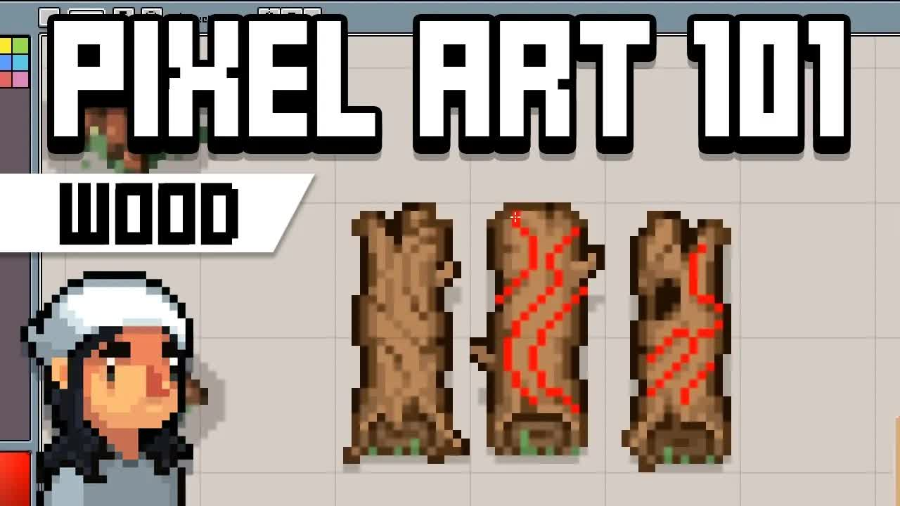

# Pixel-Art-101：-Wood-Texture

  <picture>
    
  </picture>

 

---

## Video Information

| Property | Value |
|----------|-------|
| **Video Name** | `Pixel-Art-101：-Wood-Texture` |
| **Original Link** | [YouTube Video](https://youtube.com/watch?v=nzzphDLsO8g) |
| **Total Size** | **1 file** - **34.69 MB** |
| **Quality** | **720** |
| **Status** | **Complete (100%)** |
| **Password Protected** | **NO** |

---

## Download Links

| # | File | Link |
|---|------|------|
| 1 | `Pixel-Art-101：-Wood-Texture.mp4` | [Download](https://raw.githubusercontent.com/imverifiedman/utube/main/videos/Pixel-Art-101%EF%BC%9A-Wood-Texture/Pixel-Art-101%EF%BC%9A-Wood-Texture.mp4) |

---

## How to Extract

Ready to use — no extraction needed!

---

*This tool created by [avasam.ir](https://avasam.ir)*
